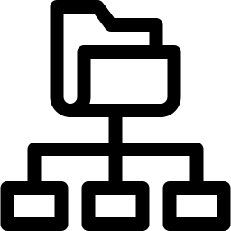

## <code></code>

## **Data Structures & Algorithms [C-and-C++]**

 
   

A consolidated list of DSA problems from university coursework and more.

Questions implemented using **C and C++**. All Genuine PRs are welcomed! Read `CONTRIBUTING.md` to contribute to this repository.  
Happy Coding! :)

## Concepts

---

- [Arrays](https://github.com/akashchouhan16/Basic-Data-structures-in-C/tree/master/Arrays "View sub-directory")
- [Binary Search Tree](https://github.com/akashchouhan16/Basic-Data-structures-in-C/tree/master/Binary%20Search%20Tree "View sub-directory")
- [Binary Tree](https://github.com/akashchouhan16/Basic-Data-structures-in-C/tree/master/Binary%20Tree "View sub-directory")
- [Dynamic Programming](https://github.com/akashchouhan16/Basic-Data-structures-in-C/tree/master/DynamicProgramming "View sub-directory")
- [Graphs](https://github.com/akashchouhan16/Basic-Data-structures-in-C/tree/master/Graphs "View sub-directory")
- [Greedy](https://github.com/akashchouhan16/Basic-Data-structures-in-C/tree/master/Greedy "View sub-directory")
- [Implementation Based](https://github.com/akashchouhan16/Data-structures-in-C-CPP/tree/master/Implementations "View sub-directory")

- [Semester LabQ](https://github.com/akashchouhan16/Basic-Data-structures-in-C/tree/master/ExtraDSAQ "View sub-directory")
- [Linked List](https://github.com/akashchouhan16/Basic-Data-structures-in-C/tree/master/Linkedlist "View sub-directory")
- [Queue](https://github.com/akashchouhan16/Basic-Data-structures-in-C/tree/master/Queue "View sub-directory")
- [Searching](https://github.com/akashchouhan16/Basic-Data-structures-in-C-CPP/tree/master/Searching "View sub-directory")
- [Sorting Algos](https://github.com/akashchouhan16/Basic-Data-structures-in-C/tree/master/SortingAlgorithms)
- [Stack](https://github.com/akashchouhan16/Data-structures-in-C-CPP/tree/master/Stack "View sub-directory")
- [Utility](https://github.com/akashchouhan16/Data-structures-in-C-CPP/tree/master/Utility "View sub-directory")

---

## Steps To Contribute :

1. **Fork** this repository
2. Use your command line\terminal to clone the forked repo
   - `git clone` **< forked repository URL>**
   - **cd** into the created local repository.
3. Add your **C/C++** code. Make sure it adheres to `CONTRIBUTING.md`.
4. `git add` **< file_name >**
5. `git commit -m` **< add_a_valid_comment >**
6. `git push` the code to your forked repository.
7. Create a **pull request**.

---

 

 

## License

**[GNU GENERAL PUBLIC LICENSE](https://github.com/akashchouhan16/Data-structures-in-C-CPP/blob/master/LICENSE "License")**

**Maintainer : [ Akash Chouhan](https://github.com/akashchouhan16/ "Akash Chouhan Profile")**
